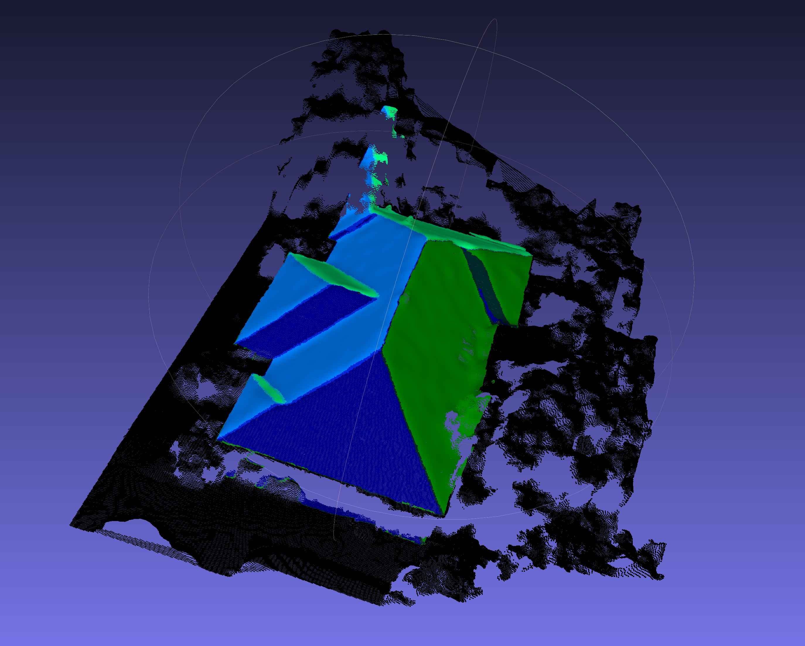
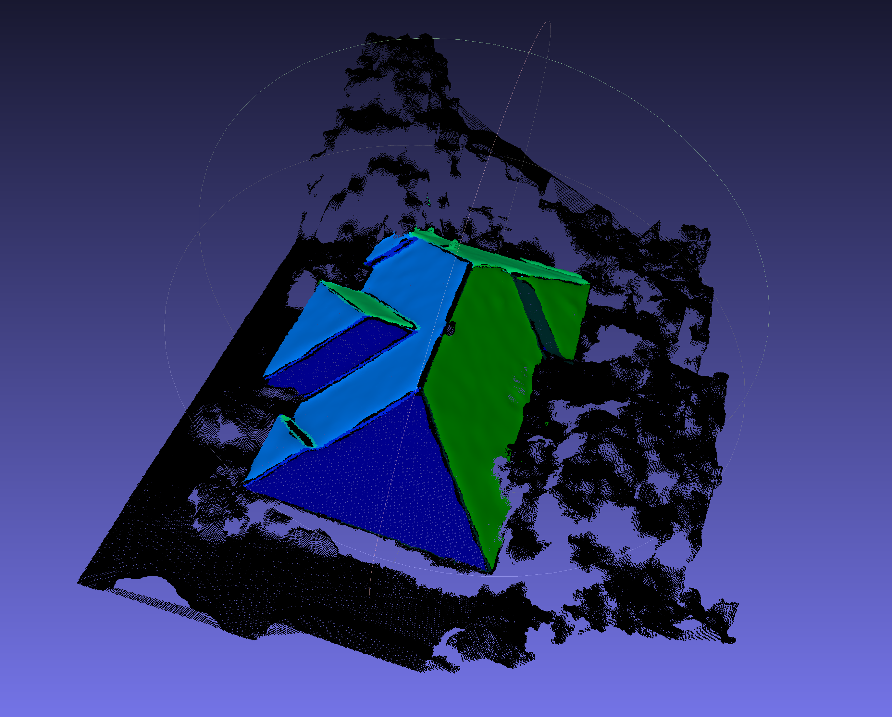

# Point Cloud Challenge

### Solo code challenge for computer vision candidates.

For this programming challenge you are tasked with processing 3D Point Cloud data
using Python and Numpy. 
Specifically, we'd like you to filter the outliers 
(anything two standard deviations from the mean) out of the roof.

You have been provided a few helper functions to get you started reading and writing `.ply` files.

You can visually test your results using a free software tool 
called [MeshLab](https://www.meshlab.net/#download) to open `.ply` files

#### The Point Cloud provided is in the following format:
* And (n x 9) matrix
* The 9 columns hold the following information:
  * Columns 0 to 3 - (x, y, z) coordinates
  * Columns 3 to 6 - (nx, ny, nz) normal vector
  * Columns 6 to 9 - (r, g, b) red, green, and blue colors 
  
#### Your solution should go as follows:
* Read in the point cloud `.ply` file provided in the data folder
* Create a mask for the roof based on anything that isn't black
* For each unique color on the roof:
    * Find outliers based on the normal vectors
    * Find outliers based on height
    * Change the colors of the outliers to black
* Save the new and updated version of the point cloud to `data/Result.ply`

#### Before Processing:

#### Example Result After Processing:

#### Deliverable:
* Clone this repository
* After completing your solution, push your code to your own public repository
* Send us a link to your public repository
* If you have any questions, please let us know